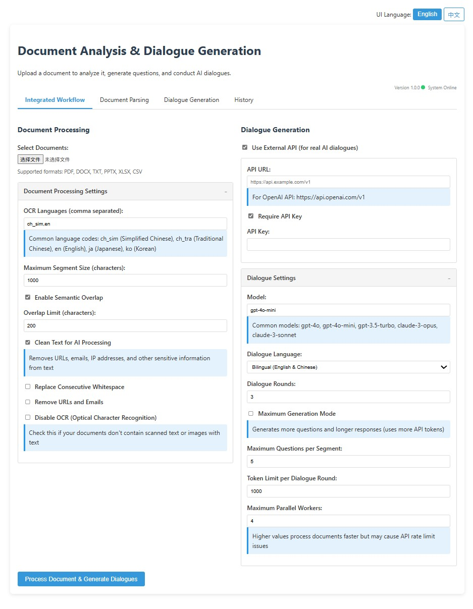
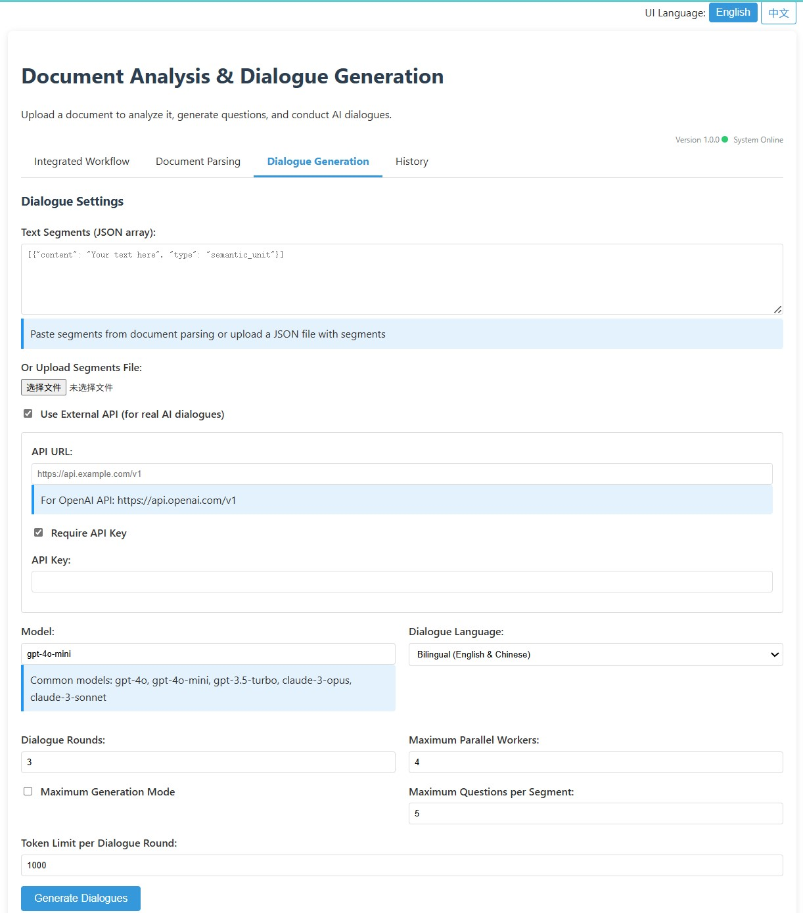
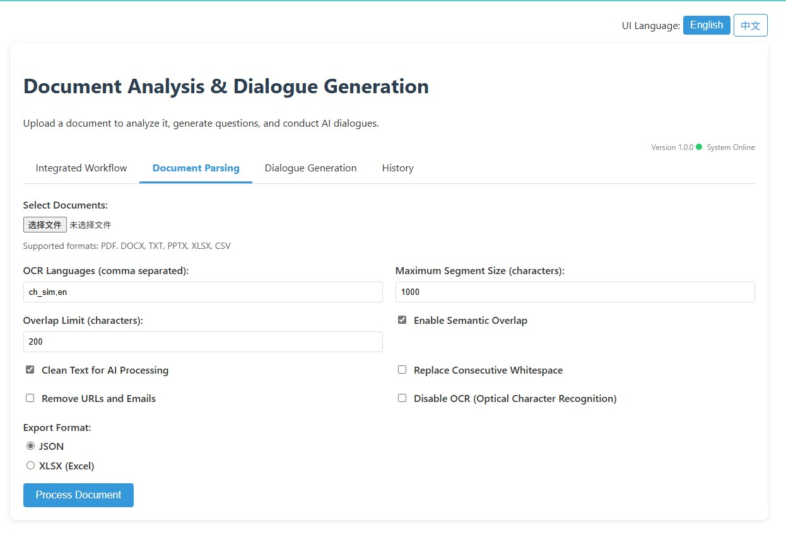
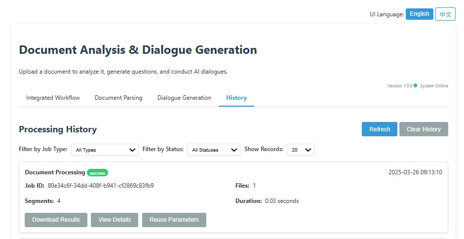

# 文档对话生成器

一款强大的文档处理和AI驱动的对话生成工具。该应用程序能够对各种文档格式进行语义解析，并基于文档内容生成交互式问答对话。

## 功能特点

- **多格式文档处理**：支持PDF、DOCX、TXT、PPTX、XLSX、CSV等文件格式
- **语义分段**：智能将文档拆分为有意义的片段
- **OCR功能**：从文档中的图像提取文本（需安装相关依赖）
- **AI对话生成**：使用语言模型创建问答对
- **并行处理**：同时处理多个文档并生成对话
- **网页界面**：用户友好的网页界面，支持任务跟踪
- **命令行界面**：强大的CLI，便于集成到工作流程中
- **导出选项**：将段落和对话导出为JSON和XLSX格式

## 系统要求

### 核心依赖
- Python 3.7+
- Flask
- NLTK
- PyMuPDF (fitz)
- python-docx
- requests

### 可选依赖
- spaCy及语言模型（用于改进语义分段）
- EasyOCR（用于OCR功能）
- openpyxl（用于Excel导出）
- python-pptx（用于PowerPoint解析）
- Pillow（用于图像处理）
- python-magic（用于更好的MIME类型检测）

## 安装

1. 克隆仓库：
   ```bash
   git clone https://github.com/your-username/document-dialogue-generator.git
   cd document-dialogue-generator
   ```

2. 创建虚拟环境：
   ```bash
   python -m venv venv
   source venv/bin/activate  # Windows系统：venv\Scripts\activate
   ```

3. 安装核心依赖：
   ```bash
   pip install -r requirements.txt
   ```

4. 安装可选依赖以获取扩展功能：
   ```bash
   pip install -r requirements-optional.txt
   ```

5. 下载NLTK数据：
   ```python
   python -c "import nltk; nltk.download('punkt')"
   ```

6. 下载spaCy语言模型（可选）：
   ```bash
   python -m spacy download en_core_web_sm
   python -m spacy download zh_core_web_sm  # 用于中文支持
   ```

## 使用方法

### 网页界面

1. 启动网络服务器：
   ```bash
   python main.py server --port 5233 --host 0.0.0.0
   ```

2. 打开浏览器并访问 `http://localhost:5233`

3. 使用界面来：
   - 上传文档
   - 配置处理参数
   - 生成对话
   - 导出结果

### 命令行界面

#### 文档处理

```bash
python main.py document path/to/document.pdf --output results.json --output-xlsx results.xlsx
```

可选参数：
- `--languages ch_sim en` - OCR语言
- `--segment-size 1200` - 最大段落大小
- `--no-overlap` - 禁用段落重叠
- `--overlap-limit 150` - 设置重叠限制
- `--no-clean-ai` - 禁用AI训练数据清理
- `--replace-whitespace` - 替换连续空白字符
- `--remove-urls-emails` - 删除URL和电子邮件
- `--disable-ocr` - 禁用OCR功能

#### 对话生成

```bash
python main.py dialogue segments.json --api-url https://api.example.com/v1 --api-key YOUR_API_KEY
```

可选参数：
- `--no-api` - 不使用API生成占位对话
- `--output-dir dialogues` - 输出目录
- `--model gpt-4o-mini` - 使用的模型
- `--rounds 3` - 对话回合数
- `--max-workers 4` - 并行工作线程数
- `--language en-zh` - 语言模式（en、zh、en-zh）
- `--max-generation-mode` - 最大生成模式
- `--max-questions 10` - 每个段落的最大问题数
- `--token-limit 1000` - 每轮对话的令牌限制

#### 集成工作流

```bash
python main.py integrated path/to/document.pdf --api-url https://api.example.com/v1 --api-key YOUR_API_KEY
```

将文档处理和对话生成合并为一个命令，并支持上述所有选项。

## API配置

对话生成组件需要兼容OpenAI聊天完成API格式的端点。您可以配置：

- API URL：API的基本URL（例如，https://api.openai.com/v1）
- API密钥：API的身份验证密钥
- 模型：用于对话生成的模型（默认：gpt-4o-mini）

如果您没有API密钥，可以使用`--no-api`选项生成演示用的占位对话。

## 历史记录跟踪

应用程序会维护处理任务的历史记录，可通过网页界面或`/api/history`端点访问。历史记录包括：

- 任务ID
- 任务类型
- 时间戳
- 处理参数
- 结果文件位置
- 状态信息

## 输出格式

- **JSON**：包含关于段落和对话的完整结构信息
- **XLSX**：Excel格式，带有语义级别检测和格式化（需要openpyxl）

## REST API端点

网页界面提供了几个REST API端点：

- `/api/process-document` - 将文档处理为段落
- `/api/generate-dialogues` - 从段落生成对话
- `/api/integrated-workflow` - 运行集成工作流
- `/api/history` - 获取处理历史
- `/api/download-results` - 以JSON格式下载结果
- `/api/download-xlsx` - 以XLSX格式下载结果





